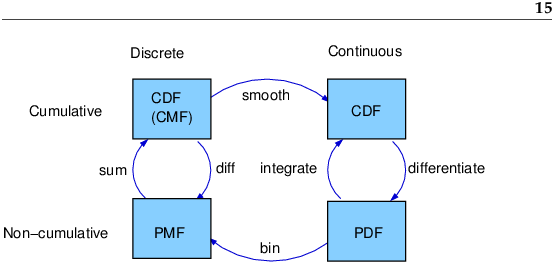

When we explore a variable like height, we would first plot its histogram. Dependent on how we bin, what we are seeing is one way of viewing its empirical distribution. We can also divide each bin by the number of samples to see the **probability mass function**, another form of empirical distribution.

Often, this distribution will often look like some of the well known analytic distributions, like Gaussian, exponential, lognormal, etc. We can thus approximate empirical distributions with analytic distributions such using **probability density function** or **cumulative distribution function**. There are smoothing methods to get to these functions, or we can use a non-parametric method like **kernel density estimation**.

Note: While PDFs are easier to understand intuitively, they are often not useful because if you want probability, you have to integrate, which results in CDFs.

!img{background-color:transparent}

There are a few benefits of approximating (aka modeling) empirical distributions with analytic distributions:  
- Weed out the noise in data  
- Form of data compression - a few parameters rather than the entire dataset
- Insight into the underlying system - e.g. if Pareto, we know that income distribution is also Pareto with preferential attachment properties  
- Lends itself to mathematical analysis  
- You can generate random numbers from this distribution by choosing random probability from 0 to 1 and calculating the inverse CDF. However, you can also use bootstrapping instead, so this one is a weak benefit.  

Common analytic distributions:  
- Normal / Gaussian  
- Exponential - Time to event  
- Pareto - Distribution of income  

Up to now, we've been looking at modeling a single variable. When looking at two variables, we would first look at a scatter plot. If there are multiple variables, we would look at a scatter plot of all the combinations. We may then calculate Pearson's correlation coefficient, but that won't capture nonlinear relationships, so it's important to look at scatter plots to catch any obvious nonlinear relationships. Spearman's rank correlation will calculate Pearson's correlation coefficient not on the standardized data but on the rank of the data. This is less affected by outliers (i.e. it's robust) and skew, and it mitigates the issue of Pearson's correlation underestimating nonlinear relationships. If one of the variables is lognormal, there is skew, but if you log that variable, it becomes normal, so calculating Person's correlation coefficient with the log of the variable can adjust for skew.

Correlation does not imply causation. What does? If one variable always occurs before the other, then that might be an indication of causation. We can also try running a randomized controlled trial (A/B test). In any case, some sound judgment, common sense, and reason are required. (Apparently regression analysis allows us to infer causal relationship?)

Estimation - When we get a sample from a population and calculate the sample mean and sample variance (n-1 to make it unbiased, 1 degree of freedom), we want to understand how unreliable the estimate is. This is know as sampling error. We can study sampling error by making assumption about the distribution of the population (e.g. assume it normal) and simulating from this distribution to calculate multiple sample means. These sample means create a sampling distribution, and we can calculate the standard error and confidence interval. Standard error is the RMSE of the sample means, and the confidence interval is the range from 5th and 95th percentile of the sampling distribution; i.e. running the simulation 100 times, 90 of the middle values landed between the lower bound and upper bound.

Standard error and confidence interval aim to understand the reliability of sample estimate, but they do not tell us the probability the real mean lies between two values. To answer this, we need Bayesian statistics.

Sample estimates will have sampling error, but in addition, they can have sampling bias and measurement error in the process of the data generation.
